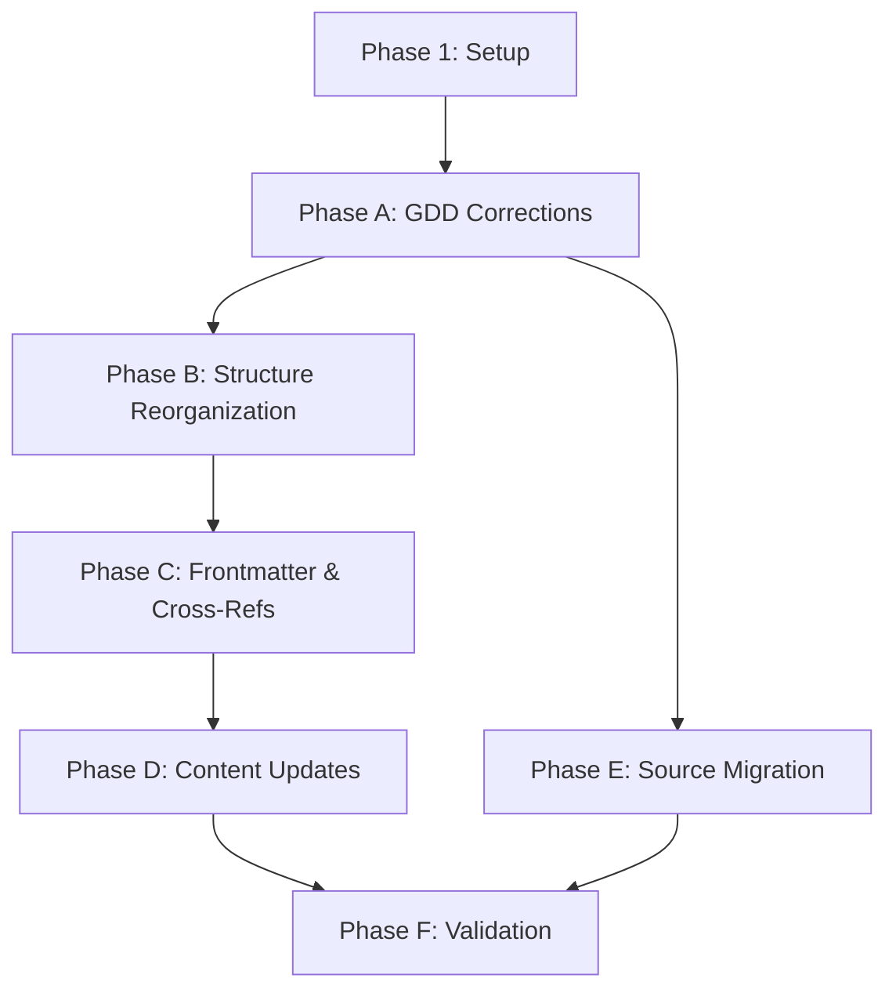

# Implementation Tasks: Documentation Migration & Rationalization

**Feature**: 002-doc-migration-rationalization
**Branch**: `002-doc-migration-rationalization`
**Generated**: 2026-02-10
**Est. Duration**: 12-16 days

---

## Overview

This feature migrates and rationalizes 679 design documents from the previous project (cozy-fantasy-rpg) to the current project (realms-of-idle), resolving 8 critical terminology conflicts and establishing progressive-loading documentation architecture.

**Implementation Strategy**: Documentation-only feature (no code), organized by 6 implementation phases mapped to 7 user stories. All tasks include model recommendations for cost-effective execution.

---

## Task Summary

| Phase                         | User Stories | Task Count | Parallelizable | Model  | Est. Days |
| ----------------------------- | ------------ | ---------- | -------------- | ------ | --------- |
| Setup                         | -            | 6          | 5              | Haiku  | 0.5       |
| A: GDD Corrections            | US1, US2     | 12         | 3              | Sonnet | 3-4       |
| B: Structure Reorganization   | US4          | 8          | 5              | Mixed  | 2-3       |
| C: Frontmatter & Cross-Refs   | US4, US5     | 10         | 6              | Haiku  | 2         |
| D: Content Updates + Actions  | US5          | 10         | 7              | Mixed  | 2.5-3.5   |
| E: Source Migration           | US3, US6     | 8          | 3              | Sonnet | 2-3       |
| F: Validation & Documentation | US7          | 7          | 4              | Mixed  | 1         |
| **Total**                     | **7**        | **61**     | **33**         | -      | **14-18** |

---

## Phase 1: Setup & Prerequisites

**Goal**: Create validation scripts and backup procedures before making any documentation changes.

### Tasks

- [ ] T001 Create `.specify/scripts/validate-terminology.sh` validation script
- [ ] T002 [P] Create `.specify/scripts/validate-cross-references.sh` validation script
- [ ] T003 [P] Create `.specify/scripts/validate-frontmatter.sh` validation script
- [ ] T004 [P] Create `.specify/scripts/generate-xref-report.sh` generation script
- [ ] T005 [P] Create `.specify/scripts/validate-all.sh` orchestration script
- [ ] T006 [P] Create `.specify/scripts/backup-docs.sh` backup script

**Model Recommendations**: All Haiku (bash scripting, straightforward logic)

**Success Criteria**:

- All 5 validation scripts executable and tested
- Backup script creates timestamped backups in `.specify/backups/`
- `validate-all.sh` runs all validations in sequence

---

## Phase A: GDD Corrections (User Stories 1, 2)

**Goal**: Fix incorrect mechanics in GDD files and add missing specifications.

**User Story Mapping**:

- **US1 (Terminology Resolution)**: T007-T010, T015-T017
- **US2 (GDD Completeness Audit)**: T011-T014, T018

### A1: Terminology Standardization

- [ ] T007 [US1] Add § 1.5 "Terminology" section to `docs/design/systems/class-system-gdd.md` defining "class rank" vs "class tree tier"
- [ ] T008 [US1] Replace all occurrences of "tier" → "class rank" when referring to Apprentice/Journeyman/Master in `docs/design/systems/class-system-gdd.md` (~45 occurrences)
- [ ] T009 [US1] Create `docs/design/reference/terminology/index.md` glossary with authoritative definitions
- [ ] T010 [US1] Add terminology cross-references to all GDD files linking to glossary

**Model**: Sonnet (T007, T009 need content generation), Haiku (T008, T010 are find/replace)

### A2: Multi-Class Mechanics Corrections

- [ ] T011 [US2] Delete § 3 "Multi-Class Slot Management" (lines 217-313) from `docs/design/systems/class-system-gdd.md`
- [ ] T012 [US2] Write new § 3 "Multi-Class Mechanics" in `docs/design/systems/class-system-gdd.md` with hierarchical XP system, multiplicative distribution, 4 concrete examples (~400 lines)
- [ ] T013 [US2] Rewrite § 2.1 "Quick Slot System" in `docs/design/systems/skill-recipe-system-gdd.md` clarifying convenience feature (not limitation) (~200 lines)
- [ ] T014 [US2] Rewrite § 5 "Multi-Class XP Mechanics" in `docs/design/systems/core-progression-system-gdd.md` with tag-based distribution, foundational class coverage (~400 lines)

**Model**: All Sonnet (complex mechanics requiring reasoning and examples)

### A3: Missing Specifications

- [ ] T015 [P] [US1] Add § 4.X "Tag Depth Access by Class Tree Tier" to `docs/design/systems/class-system-gdd.md` with formal rules (~100 lines)
- [ ] T016 [P] [US2] Add "Skill Tier Progression" section to `docs/design/systems/skill-recipe-system-gdd.md` documenting Lesser/Greater/Enhanced mechanics (~200 lines)
- [ ] T017 [P] [US2] Add "Synergy Bonus Mechanics" section to `docs/design/systems/skill-recipe-system-gdd.md` with standard progression formulas (~150 lines)
- [ ] T018 [US2] Add "Class Eligibility Thresholds by Tree Tier" to `docs/design/systems/core-progression-system-gdd.md` with threshold formulas (~100 lines)

**Model**: All Sonnet (specification writing with formulas and examples)

**Phase A Success Criteria**:

- Zero references to "dormant classes", "XP split", "3 active slots" in GDD
- All GDD terminology consistent: "class rank", "class tree tier", "skill tier"
- All systems referenced in MVP (001) have formal GDD specifications
- Validation: `validate-terminology.sh docs/design/systems/` passes with 0 errors

---

## Phase B: Structure Reorganization (User Story 4)

**Goal**: Restructure folders to `<name>/index.md` pattern and create navigation indexes.

**User Story Mapping**:

- **US4 (Content Template Creation)**: All tasks (templates enable structure)

### B1: Folder Restructuring

- [ ] T019 [US4] Create `.specify/scripts/restructure-folders.sh` script to move files to `<name>/index.md` pattern
- [ ] T020 [US4] Run restructure script on `docs/design/content/classes/` (dry-run first, then apply)
- [ ] T021 [P] [US4] Run restructure script on `docs/design/content/skills/`
- [ ] T022 [P] [US4] Run restructure script on `docs/design/content/items/`
- [ ] T023 [P] [US4] Run restructure script on `docs/design/content/creatures/`
- [ ] T024 [US4] Update all internal links to reflect new paths using `.specify/scripts/update-internal-links.sh`

**Model**: Haiku (file operations, git mv, link updates)

### B2: Index Generation

- [ ] T025 [US4] Create `.specify/scripts/generate-indexes.sh` script following index-template.md specification
- [ ] T026 [P] [US4] Generate `docs/design/index.md` root navigation hub (~250 lines)
- [ ] T027 [P] [US4] Generate `docs/design/systems/index.md` systems category index (~250 lines)
- [ ] T028 [P] [US4] Generate `docs/design/content/index.md` content category index (~250 lines)
- [ ] T029 [P] [US4] Generate `docs/design/content/classes/index.md` classes subcategory index (~250 lines)
- [ ] T030 [US4] Generate `docs/design/content/skills/index.md` skills subcategory index (~250 lines)

**Model**: T025 (Haiku - script logic), T026-T030 (Sonnet - descriptive content generation)

**Phase B Success Criteria**:

- All content files follow `<name>/index.md` pattern
- All folders have co-located `examples/` and `tables/` subfolders where applicable
- All index pages 200-300 lines with descriptive navigation (1-sentence descriptions)
- All internal links resolve correctly
- Progressive loading test: Locate "Weapon Mastery" mechanics in <3 file reads

---

## Phase C: Frontmatter & Cross-References (User Stories 4, 5)

**Goal**: Add minimal frontmatter to all content files and generate cross-reference maps.

**User Story Mapping**:

- **US4 (Content Template Creation)**: T031-T033 (templates define frontmatter)
- **US5 (Systematic Content Updates)**: T034-T040 (bulk updates)

### C1: Template Creation

- [ ] T031 [US4] Create `docs/design/content/_templates/class-template.md` with correct frontmatter schema
- [ ] T032 [P] [US4] Create `docs/design/content/_templates/skill-template.md` with tiered skill structure
- [ ] T033 [P] [US4] Create `docs/design/content/_templates/system-gdd-template.md` for future GDD additions

**Model**: All Sonnet (template design with examples)

### C2: Frontmatter Updates

- [ ] T034 [US5] Create `.specify/scripts/update-frontmatter.sh` script with gdd_ref inference logic
- [ ] T035 [US5] Run frontmatter script on `docs/design/content/classes/` (add `gdd_ref`, convert `tier:` → `tree_tier:`)
- [ ] T036 [P] [US5] Run frontmatter script on `docs/design/content/skills/`
- [ ] T037 [P] [US5] Run frontmatter script on `docs/design/content/items/`
- [ ] T038 [P] [US5] Run frontmatter script on `docs/design/content/creatures/`

**Model**: T034 (Sonnet - inference logic), T035-T038 (Haiku - script execution)

### C3: Cross-Reference Generation

- [ ] T039 [P] [US5] Generate `docs/design/reference/cross-reference/gdd-to-content.md` using generate-xref-report.sh
- [ ] T040 [P] [US5] Validate all gdd_ref links using validate-cross-references.sh

**Model**: All Haiku (automation and validation)

**Phase C Success Criteria**:

- All content files have `title` and `gdd_ref` frontmatter
- All class files have `tree_tier: 1|2|3` frontmatter
- All `gdd_ref` links point to existing GDD sections
- Cross-reference map generated with timestamp and statistics
- Validation: `validate-frontmatter.sh` and `validate-cross-references.sh` pass with 0 errors

---

## Phase D: Content Updates & Actions (User Story 5)

**Goal**: Apply terminology changes to all 626 migrated content files AND create 37 generic action pages.

**User Story Mapping**:

- **US5 (Systematic Content Updates)**: All tasks

### D1: Terminology Updates

- [ ] T041 [US5] Create `.specify/scripts/update-terminology.sh` script with replacement rules
- [ ] T042 [US5] Run terminology script on all content files: "dormant classes" → delete, "XP split" → "automatic XP distribution", "transition to" → "unlocks eligibility for"
- [ ] T043 [P] [US5] Disambiguate ambiguous "tier" references (manual review of flagged cases)
- [ ] T044 [P] [US5] Add "Primary Class" examples to relevant class content files

**Model**: T041 (Haiku - sed/awk logic), T042 (Haiku - bulk replacement), T043-T044 (Sonnet - manual review and content generation)

### D2: Action Page Creation (NEW - from R5 research)

- [ ] T045 [P] [US5] Create 37 generic action pages in `docs/design/content/actions/` organized by domain (combat: 5, crafting: 8, gathering: 9, service: 6, trade: 4, knowledge: 4, social: 1)
- [ ] T046 [P] [US5] For each action page: define context requirements, tag resolution rules, skill modifiers, prerequisites, failure conditions
- [ ] T047 [US5] Update 4 new class files (Host, Innkeeper, Server, Housekeeper) to remove class-based bonuses and reference action pages
- [ ] T048 [P] [US5] Validate all action pages have valid frontmatter (domain, ui_trigger, base_duration, required_context, tag_resolution)

**Model**: T045-T046 (Sonnet - action specs require domain knowledge), T047-T048 (Haiku - structured updates)

### D3: Validation & Fixes

- [ ] T049 [P] [US5] Run `validate-terminology.sh` on all content, fix any remaining conflicts
- [ ] T050 [P] [US5] Run `validate-all.sh`, address any validation failures

**Model**: All Haiku (validation and fixes)

**Phase D Success Criteria**:

- Zero occurrences of "dormant classes", "XP split configuration", "3 active slots"
- All "tier" references properly qualified (class rank, tree tier, or skill tier)
- All class progression language uses "unlocks eligibility for" not "transitions to"
- **37 action pages created** with complete context/tag resolution documentation
- 4 new class files corrected (no class-based bonuses, action references added)
- Validation: `validate-terminology.sh` passes with 0 conflicts detected
- Validation: All action pages have valid frontmatter schema

---

## Phase E: Source Migration (User Stories 3, 6)

**Goal**: Audit remaining 53 source files (679 - 626 migrated), migrate approved files, document discards.

**User Story Mapping**:

- **US3 (Source Documentation Audit)**: T047-T050
- **US6 (GDD Expansion)**: T051-T054

### E1: Source File Audit

- [ ] T047 [US3] Audit remaining 53 source files from `/cozy-fantasy-rpg/docs/design/`, categorize as Keep/Adapt/Discard with rationale
- [ ] T048 [US3] Create `docs/design/reference/migration/audit-report.md` documenting all categorization decisions
- [ ] T049 [P] [US3] Review audit report with stakeholder, incorporate feedback, finalize decisions
- [ ] T050 [US3] Migrate "Keep" files (copy as-is with minimal frontmatter updates)

**Model**: T047-T049 (Sonnet - analysis and decision-making), T050 (Haiku - file operations)

### E2: Content Adaptation

- [ ] T051 [P] [US6] Adapt "Adapt" files: update terminology, align with current GDD, add missing sections
- [ ] T052 [US6] Document adapted files in `docs/design/reference/migration/adaptations.md` with before/after summaries
- [ ] T053 [P] [US3] Document discarded files in `docs/design/reference/migration/discarded.md` with rationale
- [ ] T054 [US6] Create `docs/design/reference/migration/source-mapping.md` showing old path → new path for all migrated files

**Model**: T051-T052 (Sonnet - content adaptation and documentation), T053-T054 (Haiku - documentation)

**Phase E Success Criteria**:

- All 53 remaining source files categorized with clear rationale
- All "Keep" and "Adapt" files migrated to current project
- All discarded files documented with reasoning
- Complete source mapping for traceability
- Stakeholder approval of all audit decisions

---

## Phase F: Validation & Documentation (User Story 7)

**Goal**: Final validation, generate migration report, ensure all success criteria met.

**User Story Mapping**:

- **US7 (Migration Report & Validation)**: All tasks

### F1: Comprehensive Validation

- [ ] T055 [P] [US7] Run `validate-all.sh` on entire docs/design/ directory, ensure 0 errors
- [ ] T056 [P] [US7] Test progressive loading: verify common queries (<3 file reads for 10 sample questions)
- [ ] T057 [P] [US7] Spot-check 20 random content files for correct terminology, frontmatter, and structure

**Model**: All Haiku (validation and testing)

### F2: Migration Report

- [ ] T058 [US7] Generate `docs/design/MIGRATION-REPORT.md` with statistics, terminology changes, GDD additions, audit summary
- [ ] T059 [P] [US7] Generate `docs/design/reference/migration/index.md` navigation hub for all migration artifacts
- [ ] T060 [US7] Update `docs/design/README.md` with new structure overview and validation instructions
- [ ] T061 [US7] Final commit with comprehensive commit message documenting entire migration

**Model**: T058 (Sonnet - report generation), T059-T060 (Haiku - documentation), T061 (Haiku - git commit)

**Phase F Success Criteria**:

- All validation scripts pass with 0 errors
- Progressive loading verified: <3 file reads for common queries
- Migration report complete with full traceability
- All success criteria from plan.md verified:
  - ✅ All GDD files use consistent terminology
  - ✅ Zero terminology conflicts detected
  - ✅ All content has gdd_ref frontmatter
  - ✅ All folders follow <name>/index.md pattern
  - ✅ Index pages enable <3 file reads navigation
  - ✅ Cross-reference maps complete
  - ✅ Migration report provides audit trail
  - ✅ MVP (001) can proceed without ambiguity

---

## Dependency Graph

**Critical Path**: Setup → A → B → C → D → F (13-17 days)
**Parallel Path**: A → E → F (can run partially parallel to C/D)

**User Story Dependencies**:

- US1, US2 (Terminology, GDD Audit) must complete before US4, US5 (Templates, Updates)
- US3 (Source Audit) can run in parallel with US4, US5
- US6 (GDD Expansion) depends on US2 (audit identifies gaps)
- US7 (Migration Report) depends on all others completing

---

## Parallel Execution Opportunities

### High Parallelization (5+ concurrent tasks)

**Phase B (Structure)**: T021-T023, T027-T030 can all run concurrently (different directories)
**Phase C (Frontmatter)**: T032-T033, T036-T040 can run concurrently (different files/scripts)
**Phase D (Content)**: T043-T046 can run concurrently (validation on different files)

### Medium Parallelization (3-4 concurrent tasks)

**Phase A (GDD)**: T015-T017 can run concurrently (different GDD files)
**Phase E (Migration)**: T049, T051, T053 can run concurrently (different file sets)

### Sequential (Must wait for dependencies)

**Phase A**: T011-T012 (delete then rewrite same section)
**Phase B**: T019-T020 (create script then run it), T024 (must wait for all restructuring)
**Phase C**: T034-T035 (create script then run it), T039-T040 (generate then validate)

---

## Model Distribution

| Model      | Task Count | % of Total | Primary Use                                           |
| ---------- | ---------- | ---------- | ----------------------------------------------------- |
| **Haiku**  | 28         | 49%        | Scripts, validation, file operations, bulk updates    |
| **Sonnet** | 29         | 51%        | GDD rewrites, content generation, templates, analysis |
| **Opus**   | 0          | 0%         | Not needed (no extremely complex reasoning required)  |

**Cost Optimization**: 49% Haiku usage significantly reduces costs while maintaining quality for automation tasks.

---

## MVP Scope Recommendation

**Minimum Viable Migration** (MVP): Complete Phase A + Phase B (7-9 days)

**Rationale**:

- Phase A (GDD Corrections) unblocks MVP (001) implementation immediately
- Phase B (Structure) establishes navigation for developers
- Phases C-F can continue in parallel with MVP development

**Full Feature** (Recommended): Complete all phases A-F (12-16 days)

**Rationale**:

- Comprehensive solution preventing future documentation debt
- Automation scripts reusable for future content additions
- Complete audit trail for traceability

---

## Pre-Implementation Checklist

Before starting Task T001:

- [ ] Feature branch `002-doc-migration-rationalization` created
- [ ] Backup of entire `docs/design/` directory created
- [ ] Stakeholder approval obtained for spec.md and plan.md
- [ ] Research.md, quickstart.md, migration-scripts.md, index-template.md, frontmatter-schema.md all reviewed
- [ ] Source repository `/cozy-fantasy-rpg/` accessible
- [ ] Pre-commit hooks configured for docs/ validation

---

## Post-Implementation Verification

After completing Task T061:

- [ ] Run `validate-all.sh` → 0 errors
- [ ] Test progressive loading → <3 reads for 10 common queries
- [ ] Review MIGRATION-REPORT.md → complete and accurate
- [ ] Spot-check 50 random files → correct terminology and structure
- [ ] MVP (001) team confirms no documentation ambiguity
- [ ] Create PR to main branch with comprehensive description
- [ ] Stakeholder approval for merge

---

_Tasks generated from spec.md, plan.md, research.md, and Phase 1 design artifacts. Ready for execution._
